# Visual Architecture Documentation
## nU3.Framework System Architecture

**Version:** 1.0
**Date:** February 2026
**Format:** Mermaid Diagrams (renderable in GitHub, VS Code, and Mermaid Live Editor)

---

## 📋 Table of Contents

1. [System Context Diagram](#system-context-diagram)
2. [Container Diagram](#container-diagram)
3. [Component Diagram](#component-diagram)
4. [Sequence Diagrams](#sequence-diagrams)
5. [Deployment Diagram](#deployment-diagram)
6. [Data Flow Diagrams](#data-flow-diagrams)
7. [Module Loading Flow](#module-loading-flow)
8. [Update Deployment Flow](#update-deployment-flow)

---

## System Context Diagram

Shows the external entities that interact with the nU3.Framework system.

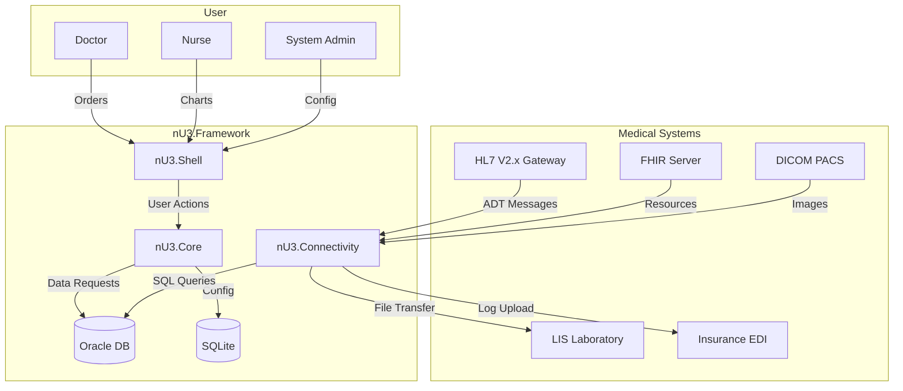

**Legend:**
- **Solid arrows:** Direct communication
- **Dashed arrows:** API/Web Service calls
- **Database:** SQLite (local) / Oracle (server)

---

## Container Diagram

Shows high-level architectural containers and their relationships.

```mermaid
graph TB
    subgraph "nU3.Framework Platform"
        direction TB

        subgraph "Client Layer"
            Client[nU3.Client<br/>(WinForms Application)]
        end

        subgraph "Infrastructure Layer"
            Bootstrapper[nU3.Bootstrapper<br/>(Deployment & Loading)]
            Connectivity[nU3.Connectivity<br/>(HTTP Clients)]
        end

        subgraph "Core Layer"
            Core[nU3.Core<br/>(Base Classes & Interfaces)]
            Security[nU3.Security<br/>(JWT & RBAC)]
        end

        subgraph "Application Layer"
            Shell[nU3.Shell<br/>(MDI Container)]
            Modules[nU3.Modules.<br/>(Business Modules)]
        end

        subgraph "Data Layer"
            LocalDB[(SQLite<br/>Configuration)]
            OracleDB[(Oracle<br/>Business Data)]
        end

        Client --> Bootstrapper
        Client --> Shell
        Client --> Connectivity

        Bootstrapper --> Core
        Connectivity --> Core
        Connectivity --> OracleDB

        Core --> Shell
        Shell --> Modules

        Core --> LocalDB
        Core --> Security
        Shell --> Security
    end

    style Client fill:#e1f5ff
    style Shell fill:#fff4e1
    style Modules fill:#ffe1e1
    style OracleDB fill:#e1ffe1
```

---

## Component Diagram

Detailed component view showing internal architecture.

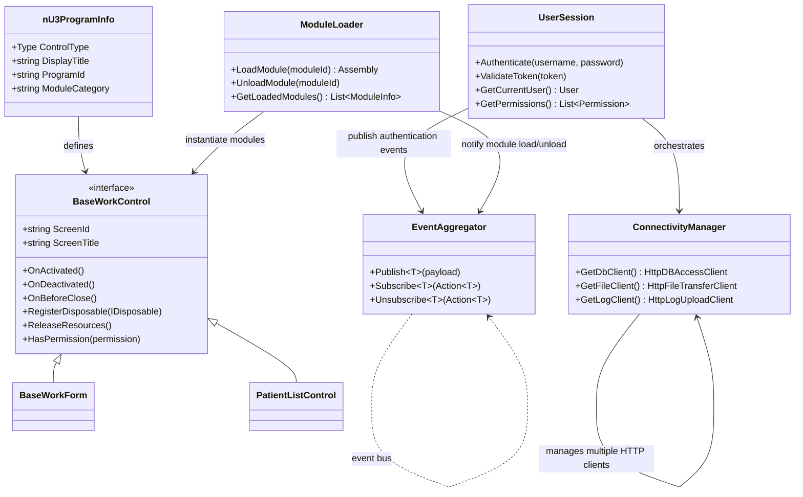

---

## Sequence Diagrams

### Module Loading Sequence

Shows how a user navigates to a module and it's loaded dynamically.

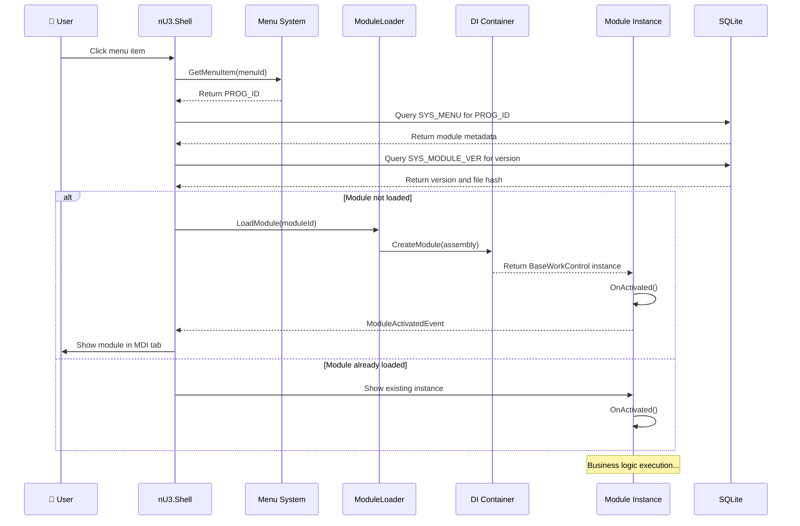

### Event-Driven Communication

Shows inter-module communication using the Event Aggregator.

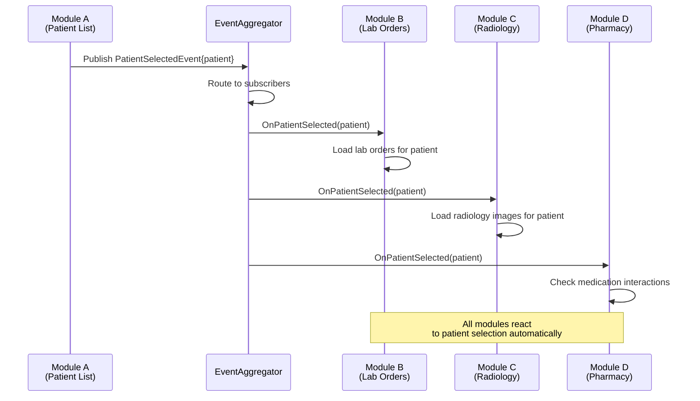

### Update Deployment Flow

Shows how the framework updates modules without restart.

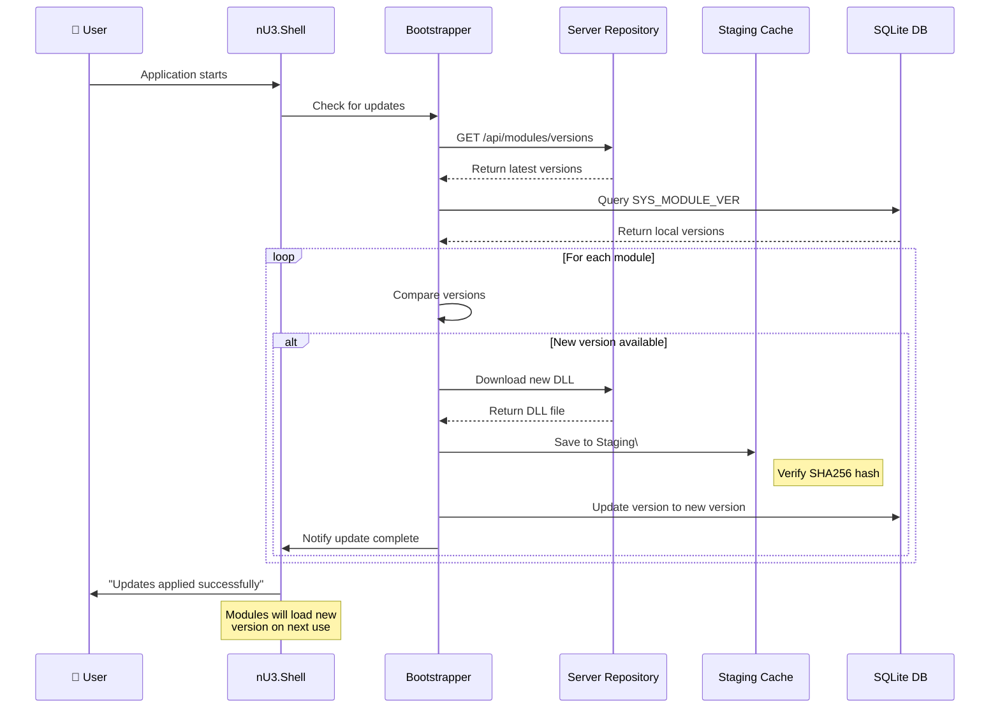

---

## Deployment Diagram

Shows physical deployment architecture.

```mermaid
graph TB
    subgraph "🏥 Hospital Network"
        direction LR

        subgraph "Workstations (Multiple)"
            WS1[WinForms Workstation 1]
            WS2[WinForms Workstation 2]
            WS3[WinForms Workstation 3]
        end

        subgraph "File Server"
            FS[Shared File Server<br/>(Modules, Configs)]
        end

        subgraph "Application Server"
            AppServer[nU3.Server.Host<br/>(ASP.NET Core API)]
        end

        subgraph "Database Server"
            OracleDB[(Oracle Database)]
            SQLite[(SQLite Local Config)]
        end

        subgraph "Archive Server"
            Archive[Archive Server<br/>(Module Archives)]
        end
    end

    WS1 --> FS
    WS2 --> FS
    WS3 --> FS

    WS1 -.->|HTTPS| AppServer
    WS2 -.->|HTTPS| AppServer
    WS3 -.->|HTTPS| AppServer

    AppServer --> OracleDB
    AppServer --> Archive
```

---

## Data Flow Diagrams

### Authentication Flow

Shows how a user logs in and gets authenticated.

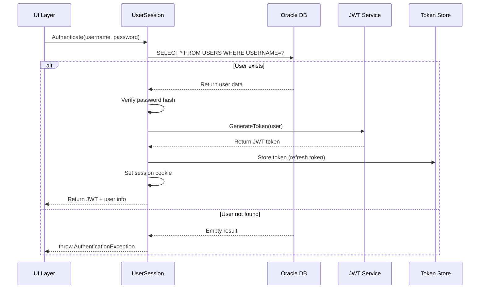

### CRUD Operation Flow

Shows standard data access pattern.

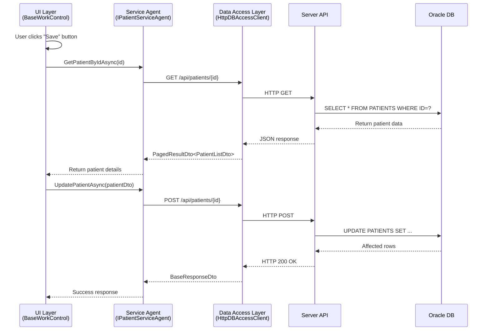

---

## Module Loading Flow

Detailed view of how the module loader discovers and loads modules.

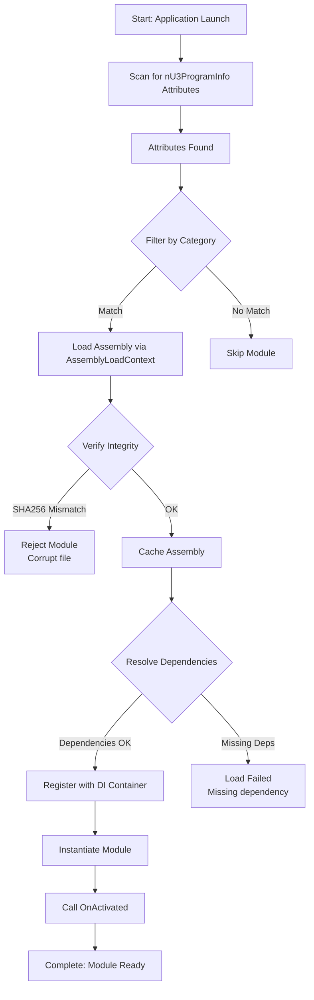

---

## Update Deployment Flow

Detailed view of how modules are updated.

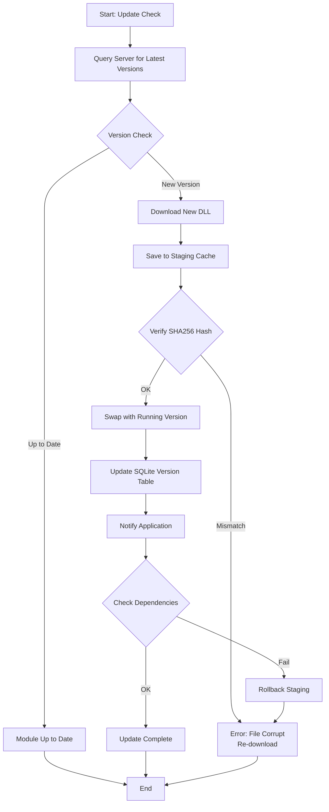

---

## Component Relationships

### Dependency Graph

Shows module dependencies.

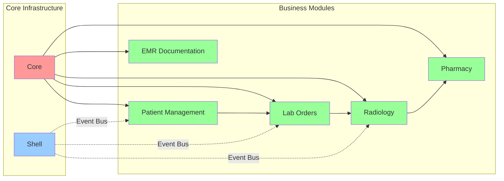

---

## Architecture Layers

### 5-Layer Architecture Diagram

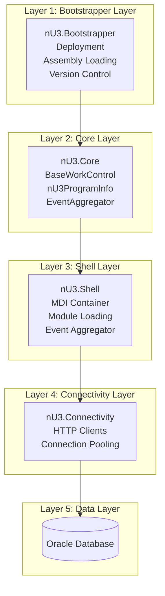

---

## Medical Standards Integration

### HL7 ADT Message Flow

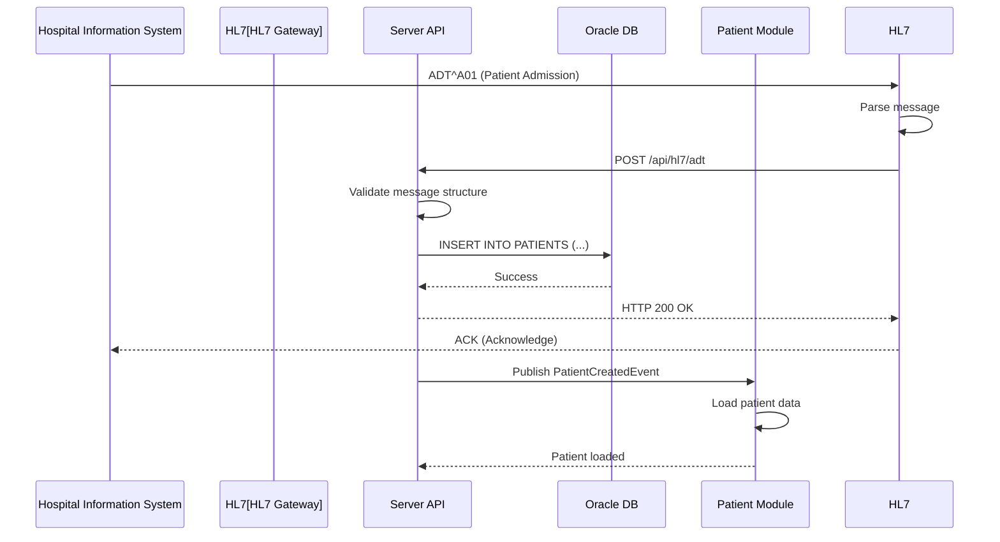

### FHIR Resource Mapping

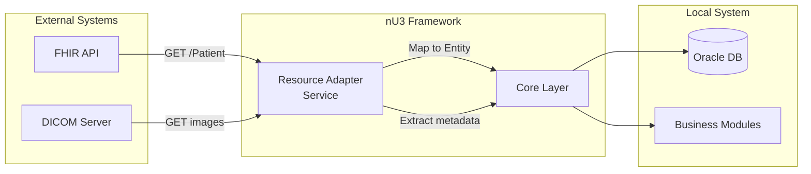

---

## Security Architecture

### JWT Token Flow

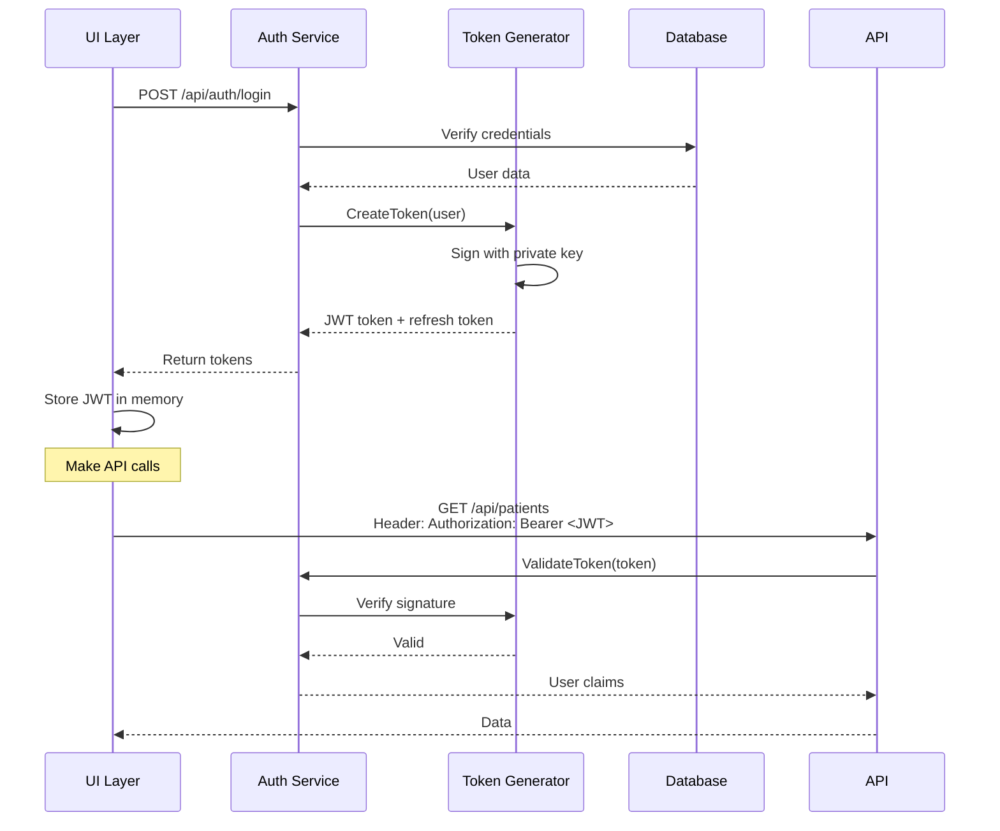

### RBAC Permission Check

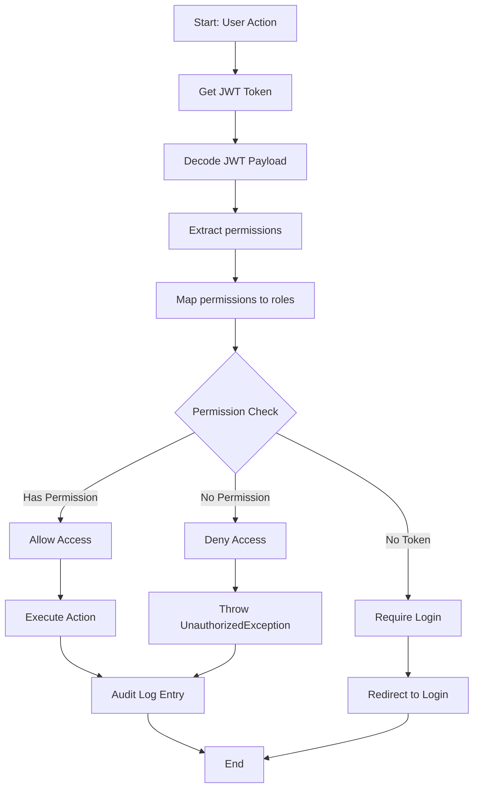

---

## Appendix: Mermaid Diagram Best Practices

### Rendering Options

1. **GitHub:**
   - Automatically renders Mermaid diagrams
   - No special syntax needed

2. **VS Code:**
   - Install "Markdown Preview Mermaid Support" extension
   - Press `Ctrl+Shift+V` to preview

3. **Online:**
   - [Mermaid Live Editor](https://mermaid.live/)
   - Copy-paste diagrams to render

### Diagram Types Used

| Type | Purpose | Examples |
|------|---------|----------|
| **graph TB/LR** | High-level architecture | System Context, Deployment |
| **sequenceDiagram** | Workflow interactions | Module Loading, Event Flow |
| **classDiagram** | Class relationships | Component Structure |
| **stateDiagram** | State transitions | Login flow, Update deployment |
| **ERD** | Database schema | Module structure |

---

**Document Version:** 1.0
**Last Updated:** February 2026
**Next Review:** April 2026 (Phase 2 completion)
