# 시각적 아키텍처 문서
## nU3.Framework 시스템 아키텍처

**버전:** 1.0
**날짜:** 2026년 2월
**형식:** Mermaid 다이어그램 (GitHub, VS Code, Mermaid Live Editor에서 렌더링)

---

## 📋 목차

1. [시스템 컨텍스트 다이어그램](#시스템-컨텍스트-다이어그램)
2. [컨테이너 다이어그램](#컨테이너-다이어그램)
3. [컴포넌트 다이어그램](#컴포넌트-다이어그램)
4. [시퀀스 다이어그램](#시퀀스-다이어그램)
5. [배포 다이어그램](#배포-다이어그램)
6. [데이터 흐름 다이어그램](#데이터-흐름-다이어그램)
7. [모듈 로딩 흐름](#모듈-로딩-흐름)
8. [업데이트 배포 흐름](#업데이트-배포-흐름)

---

## 시스템 컨텍스트 다이어그램

외부 엔티티와 nU3.Framework 시스템 간의 상호 작용을 보여줍니다.

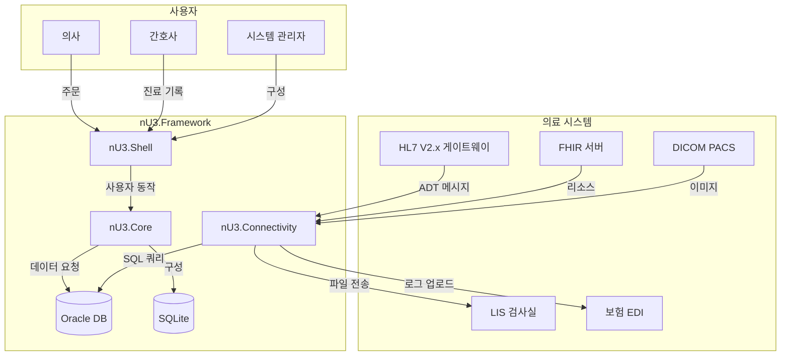

**범례:**
- **실선 화살표:** 직접 통신
- **파선 화살표:** API/Web 서비스 호출
- **데이터베이스:** SQLite (로컬) / Oracle (서버)

---

## 컨테이너 다이어그램

고차 수준 아키텍처 컨테이너 및 그 관계를 보여줍니다.

```mermaid
graph TB
    subgraph "nU3.Framework 플랫폼"
        direction TB

        subgraph "클라이언트 계층"
            Client[nU3.Client<br/>(WinForms 애플리케이션)]
        end

        subgraph "인프라 계층"
            Bootstrapper[nU3.Bootstrapper<br/>(배포 및 로딩)]
            Connectivity[nU3.Connectivity<br/>(HTTP 클라이언트)]
        end

        subgraph "코어 계층"
            Core[nU3.Core<br/>(기본 클래스 및 인터페이스)]
            Security[nU3.Security<br/>(JWT 및 RBAC)]
        end

        subgraph "애플리케이션 계층"
            Shell[nU3.Shell<br/>(MDI 컨테이너)]
            Modules[nU3.Modules.<br/>(비즈니스 모듈)]
        end

        subgraph "데이터 계층"
            LocalDB[(SQLite<br/>(구 configuration))]
            OracleDB[(Oracle<br/>(비즈니스 데이터))]
        end

        Client --> Bootstrapper
        Client --> Shell
        Client --> Connectivity

        Bootstrapper --> Core
        Connectivity --> Core
        Connectivity --> OracleDB

        Core --> Shell
        Shell --> Modules

        Core --> LocalDB
        Core --> Security
        Shell --> Security
    end

    style Client fill:#e1f5ff
    style Shell fill:#fff4e1
    style Modules fill:#ffe1e1
    style OracleDB fill:#e1ffe1
```

---

## 컴포넌트 다이어그램

상세 컴포넌트 보기 및 내부 아키텍처를 보여줍니다.

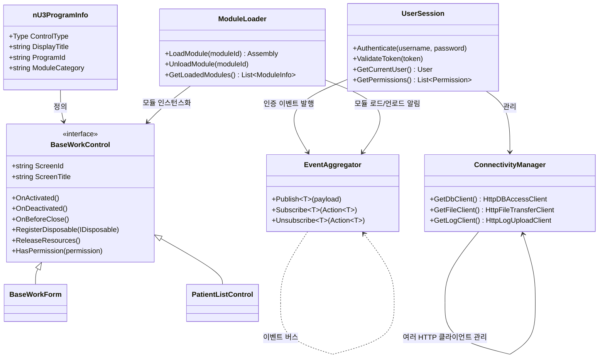

---

## 시퀀스 다이어그램

### 모듈 로딩 시퀀스

사용자가 메뉴 항목을 클릭하고 모듈이 동적으로 로드되는 방법을 보여줍니다.

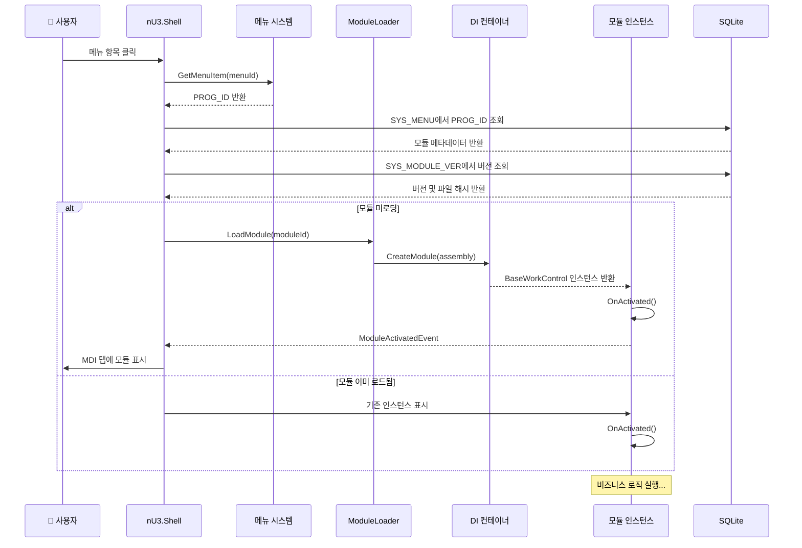

### 이벤트 기반 통신

이벤트 에그리게이터를 사용한 모듈 간 통신을 보여줍니다.

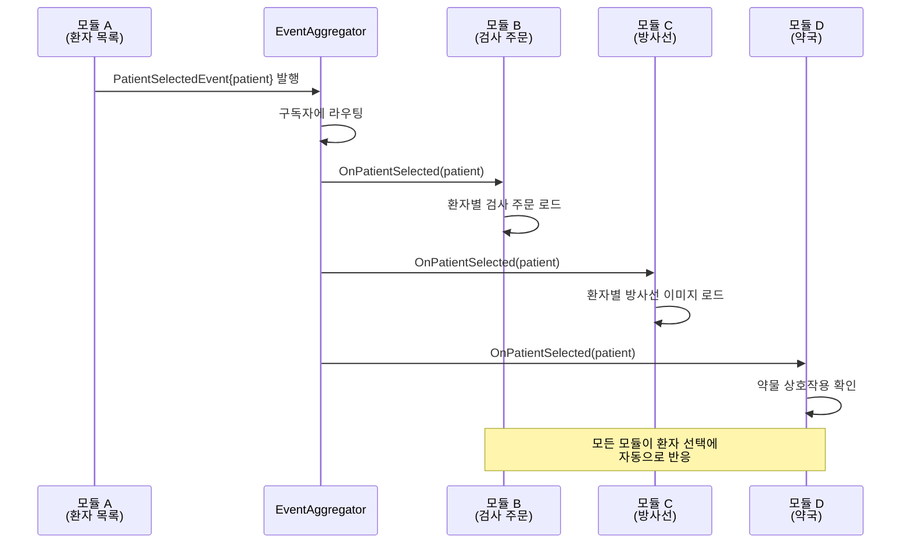

### 업데이트 배포 흐름

시스템이 모듈을 업데이트하며 재시작 없이 작동하는 방법을 보여줍니다.

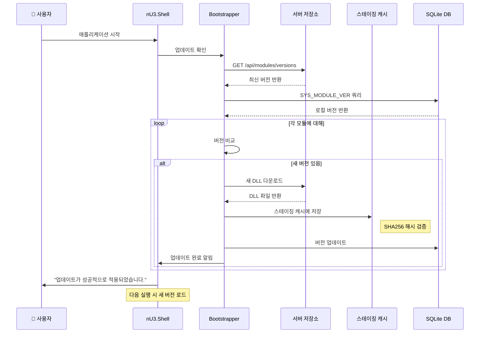

---

## 배포 다이어그램

물리적 배포 아키텍처를 보여줍니다.

```mermaid
graph TB
    subgraph "병원 네트워크"
        direction LR

        subgraph "워크스테이션 (여러 대)"
            WS1[WinForms 워크스테이션 1]
            WS2[WinForms 워크스테이션 2]
            WS3[WinForms 워크스테이션 3]
        end

        subgraph "파일 서버"
            FS[공유 파일 서버<br/>(모듈, 구성)]
        end

        subgraph "애플리케이션 서버"
            AppServer[nU3.Server.Host<br/>(ASP.NET Core API)]
        end

        subgraph "데이터베이스 서버"
            OracleDB[(Oracle DB)]
            SQLite[(SQLite 로컬 구성)]
        end

        subgraph "아카이브 서버"
            Archive[아카이브 서버<br/>(모듈 아카이브)]
        end
    end

    WS1 --> FS
    WS2 --> FS
    WS3 --> FS

    WS1 -.->|HTTPS| AppServer
    WS2 -.->|HTTPS| AppServer
    WS3 -.->|HTTPS| AppServer

    AppServer --> OracleDB
    AppServer --> Archive
```

---

## 데이터 흐름 다이어그램

### 인증 흐름

사용자가 로그인하고 인증되는 과정을 보여줍니다.

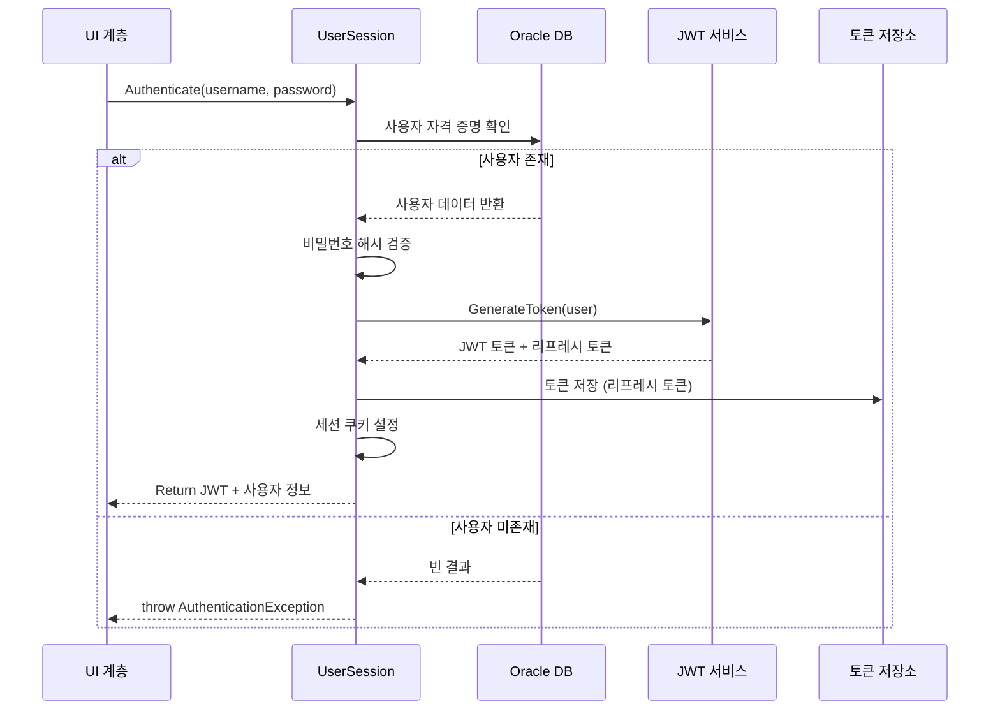

### CRUD 작업 흐름

표준 데이터 액세스 패턴을 보여줍니다.

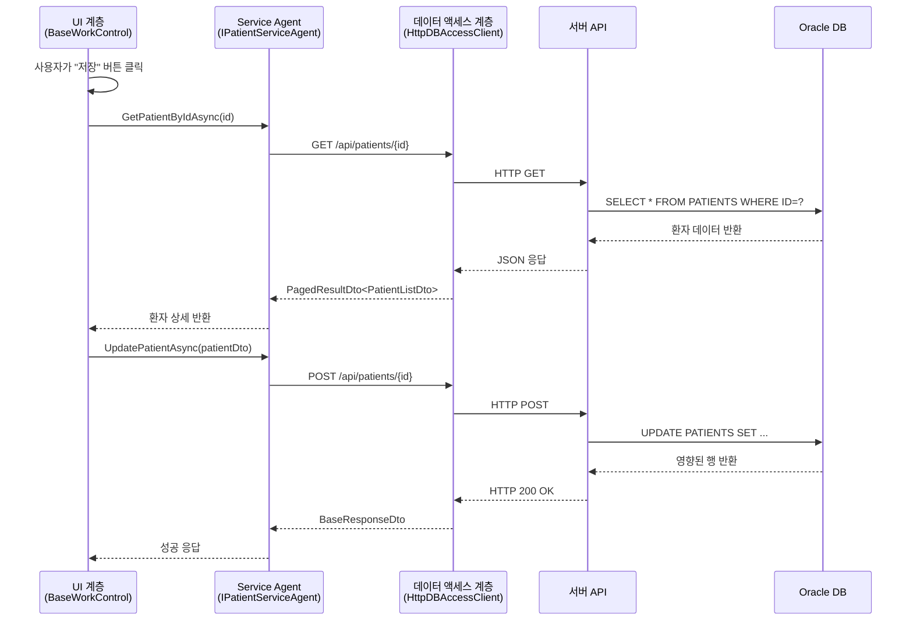

---

## 모듈 로딩 흐름

메타데이터 발견 및 모듈 로딩의 단계별 프로세스를 보여줍니다.

```mermaid
graph TD
    Start[시작: 애플리케이션 시작] --> Scan[nU3ProgramInfo 속성 스캔]

    Scan --> Found[속성 발견]

    Found --> Filter{카테고리 필터링}

    Filter -->|일치| Load[AssemblyLoadContext를 통해 어셈블리 로드]
    Filter -->|불일치| Skip[모듈 건너뜀]

    Load --> Verify{무결성 검증}
    Verify -->|SHA256 불일치| Reject[모듈 거부<br/>파일 손상됨]
    Verify -->|OK| Cache[어셈블리 캐싱]

    Cache --> Resolve{의존성 확인}
    Resolve -->|의존성 OK| Register[DI 컨테이너 등록]
    Resolve -->|누락된 의존성| Fail[로딩 실패<br/>의존성 누락]

    Register --> Instantiate[모듈 인스턴스화]
    Instantiate --> Lifecycle[OnActivated() 호출]
    Lifecycle --> Complete[완료: 모듈 준비]
```

---

## 업데이트 배포 흐름

모듈 업데이트의 단계별 프로세스를 보여줍니다.

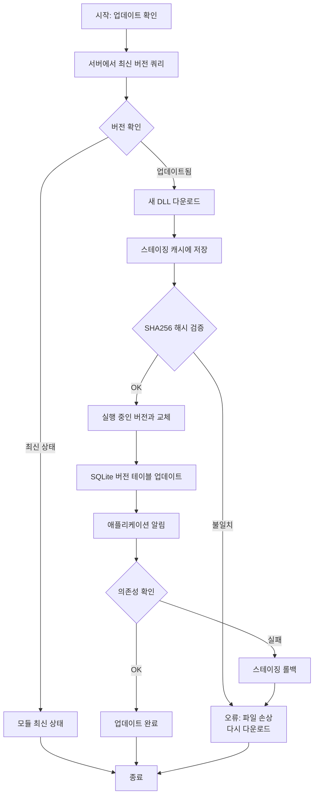

---

## 컴포넌트 관계

### 의존성 그래프

모듈 의존성을 보여줍니다.

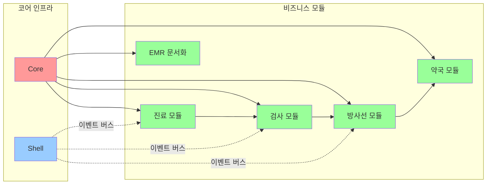

---

## 아키텍처 계층

### 5계층 아키텍처 다이어그램

```mermaid
graph TB
    subgraph "Layer 5: 데이터 계층"
        DataLayer[(Oracle DB)]
    end

    subgraph "Layer 4: 연결성 계층"
        Connect[nU3.Connectivity<br/>HTTP 클라이언트<br/>연결 풀링]
    end

    subgraph "Layer 3: 쉘 계층"
        Shell[nU3.Shell<br/>(MDI 컨테이너)<br/>모듈 로딩<br/>이벤트 에그리게이터]
    end

    subgraph "Layer 2: 코어 계층"
        Core[nU3.Core<br/>(BaseWorkControl)<br/>(nU3ProgramInfo)<br/>(EventAggregator)]
    end

    subgraph "Layer 1: 부트스트래퍼 계층"
        Boot[nU3.Bootstrapper<br/>(배포)<br/>(어셈블리 로딩)<br/>(버전 제어)]
    end

    Boot --> Core
    Core --> Shell
    Shell --> Connect
    Connect --> DataLayer
```

---

## 의료 표준 통합

### HL7 ADT 메시지 흐름

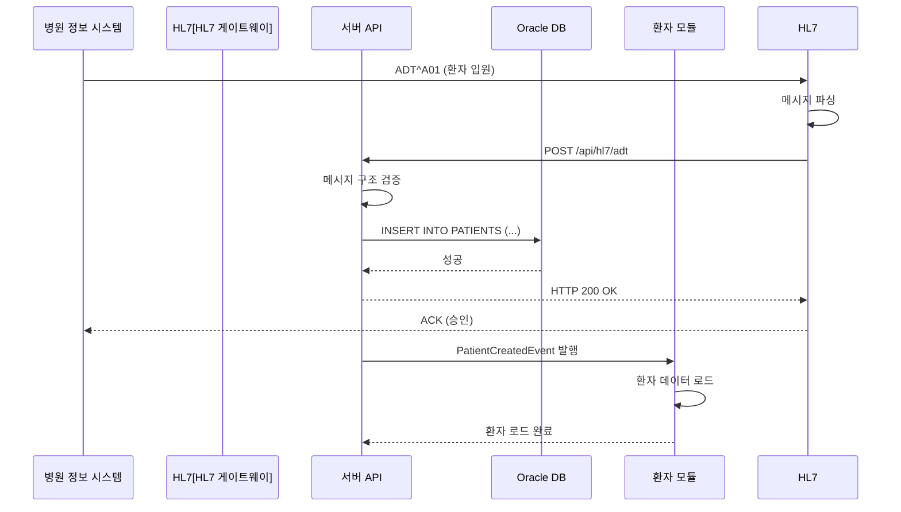

### FHIR 리소스 매핑

```mermaid
graph LR
    subgraph "외부 시스템"
        FHIR[FHIR API]
        DICOM[DICOM 서버]
    end

    subgraph "nU3 Framework"
        Adapter[리소스 어댑터<br/>(Service)]
        Core[코어 계층]
    end

    subgraph "로컬 시스템"
        Oracle[(Oracle DB)]
        Modules[비즈니스 모듈]
    end

    FHIR -->|GET /Patient| Adapter
    Adapter -->|엔티티로 매핑| Core
    Core --> Oracle

    DICOM -->|GET 이미지| Adapter
    Adapter -->|메타데이터 추출| Core
    Core --> Modules
```

---

## 보안 아키텍처

### JWT 토큰 흐름

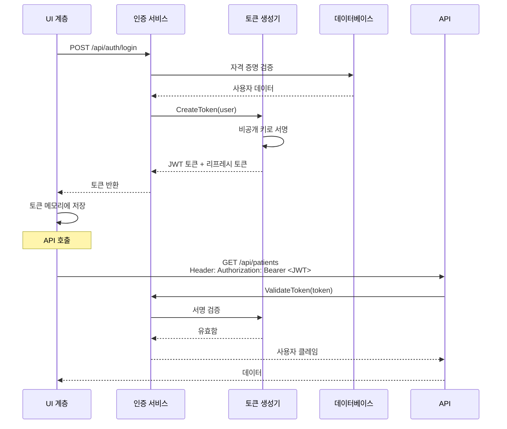

### RBAC 권한 확인

```mermaid
graph TB
    Start[시작: 사용자 동작] --> GetToken[JWT 토큰 가져오기]

    GetToken --> Decode[JWT 페이로드 디코딩]
    Decode --> Extract[권한 추출]
    Extract --> Map[권한을 역할로 매핑]

    Map --> Check{권한 확인}

    Check -->|권한 있음| Allow[권한 부여]
    Check -->|권한 없음| Deny[권한 거부]
    Check -->|토큰 없음| RequireLogin[로그인 필요]

    Allow --> Execute[동작 실행]
    Deny --> Throw[UnauthorizedException 발생]
    RequireLogin -> Redirect[로그인 페이지로 리다이렉트]

    Execute --> Audit[감사 로그 항목 생성]
    Throw --> Audit

    Audit --> End[종료]
    Redirect --> End
```

---

## 부록: Mermaid 다이어그램 베스트 프랙티스

### 렌더링 옵션

1. **GitHub:**
   - Mermaid 다이어그램 자동 렌더링
   - 특별한 문법 필요 없음

2. **VS Code:**
   - "Markdown Preview Mermaid Support" 확장 설치
   - `Ctrl+Shift+V`로 미리보기

3. **온라인:**
   - [Mermaid Live Editor](https://mermaid.live/)
   - 다이어그램 복사하여 렌더링

### 사용된 다이어그램 유형

| 유형 | 목적 | 예시 |
|------|------|------|
| **graph TB/LR** | 고차 수준 아키텍처 | 시스템 컨텍스트, 배포 |
| **sequenceDiagram** | 워크플로우 상호 작용 | 모듈 로딩, 이벤트 흐름, 업데이트 |
| **classDiagram** | 클래스 관계 | 컴포넌트 구조 |
| **stateDiagram** | 상태 전환 | 로그인 흐름, 업데이트 배포 |
| **ERD** | 데이터베이스 스키마 | 모듈 구조 |

---

**문서 버전:** 1.0
**최종 업데이트:** 2026년 2월
**다음 검토:** 2026년 4월 (Phase 2 완료 후)
