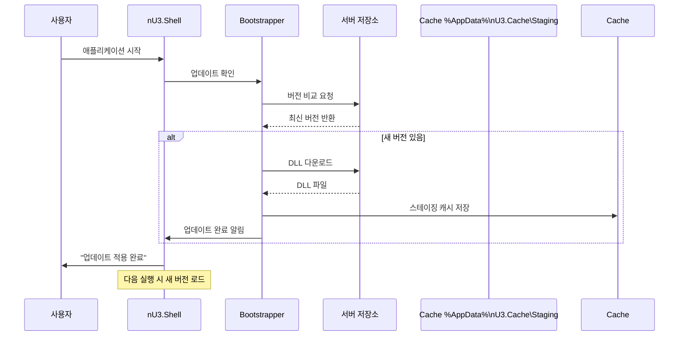

# nU3.Framework: Quick Start Guide
## 개발자를 위한 20분 완성 가이드

**버전:** 1.0 (POC Phase 1)
**소요 시간:** 20분
**대상:** WinForms 개발자, DevExpress 사용자

---

## 📋 목차

1. [준비물](#준비물)
2. [프로젝트 생성](#프로젝트-생성)
3. [화면 개발 - 10단계](#화면-개발-10단계)
4. [데이터베이스 연결](#데이터베이스-연결)
5. [디플로이](#디플로이)
6. [완료 확인](#완료-확인)

---

## 준비물

### 필수 소프트웨어
- ✅ Visual Studio 2022 (Community/Professional/Enterprise)
- ✅ .NET 8.0 SDK
- ✅ DevExpress WinForms v23.2.9
- ✅ nU3.Framework POC 소스코드

### 필수 라이브러리
```
nU3.Core (Core library)
nU3.Shell (Shell container)
nU3.Bootstrapper (Deployment)
nU3.Connectivity (HTTP clients)
```

### 개발자 경험 (Developer Experience)
- 최소 1년 이상 WinForms 개발 경력
- C# 12.0 문법 이해
- DevExpress GridControl/RepositoryItem familiarity

---

## 프로젝트 생성

### 방법 1: Deployer 템플릿 사용 (추천)

```bash
# Deployer 실행
nU3.Deployer.exe --new-module

# 다음 정보 입력:
Module Name: nU3.Modules.Test.HelloWorld
Category: EMR
SubSystem: IN (Inpatient)
Display Title: 안녕하세요 화면

# 생성된 프로젝트 구조:
nU3.Modules.Test.HelloWorld/
├── PatientListControl.cs      # 화면 컨트롤
├── PatientListViewModel.cs    # 뷰 모델
├── DTOs/
│   └── PatientInfoDto.cs
├── Services/
│   └── IPatientServiceAgent.cs
└── bin/Release/net8.0/
```

### 방법 2: Visual Studio 템플릿

1. **Visual Studio에서 새 프로젝트 생성:**
   ```
   템플릿 검색: nU3 Module
   템플릿 선택: nU3 Module (WinForms)
   ```

2. **프로젝트 이름 입력:**
   ```
   nU3.Modules.Test.HelloWorld
   ```

3. **프로젝트 생성 완료:**

---

## 화면 개발 - 10단계

### 단계 1: nU3ProgramInfo 어트리뷰트 추가 (필수)

**위치:** `PatientListControl.cs` 파일 맨 위

```csharp
using nU3.Core;

namespace nU3.Modules.Test.HelloWorld
{
    [nU3ProgramInfo(
        controlType: typeof(PatientListControl),
        displayTitle: "안녕하세요 화면",
        programId: "PROG_HELLO_WORLD",
        category: "CHILD"
    )]
    public partial class PatientListControl : BaseWorkControl
    {
        public override string ScreenId => "PROG_HELLO_WORLD";
        // ... 나머지 코드
    }
}
```

**설명:**
- `nU3ProgramInfo`: 모듈 발견을 위한 메타데이터
- `controlType`: 컨트롤 타입
- `displayTitle`: 메뉴에 표시할 제목
- `programId`: 고유 프로그램 ID (예: PROG_001, PROG_002)
- `category`: "CHILD" 또는 "PARENT"

---

### 단계 2: BaseWorkControl 상속 (필수)

```csharp
using DevExpress.XtraEditors;
using nU3.Core.UI.Controls;

namespace nU3.Modules.Test.HelloWorld
{
    [nU3ProgramInfo(
        controlType: typeof(PatientListControl),
        displayTitle: "안녕하세요 화면",
        programId: "PROG_HELLO_WORLD",
        category: "CHILD"
    )]
    public partial class PatientListControl : BaseWorkControl  // ← 상속 변경
    {
        public override string ScreenId => "PROG_HELLO_WORLD";

        public PatientListControl()
        {
            InitializeComponent();
        }

        protected override void OnActivated()
        {
            base.OnActivated();
            // 화면 활성화 시 실행
            LoadData();
        }

        protected override void OnDeactivated()
        {
            base.OnDeactivated();
            // 화면 비활성화 시 실행
        }

        private void LoadData()
        {
            // 데이터 로드 로직
            MessageBox.Show("안녕하세요! PatientListControl 활성화됨.");
        }
    }
}
```

**핵심 메서드:**
- `OnActivated()`: 화면이 활성화될 때 1회 호출
- `OnDeactivated()`: 화면이 비활성화될 때 호출
- `OnBeforeClose()`: 화면 닫기 직전 호출

---

### 단계 3: 디자이너 코드 수정 (중요)

**이유:** WinForms 디자이너는 람다식을 지원하지 않음

```csharp
// ❌ 잘못된 방법 (디자이너에서 생성됨)
this.simpleButton1.Click += (s, e) =>
{
    MessageBox.Show("클릭됨");
};

// ✅ 올바른 방법 (수동 구현)
private void InitializeComponent()
{
    this.simpleButton1 = new DevExpress.XtraEditors.SimpleButton();
    this.simpleButton1.Name = "simpleButton1";
    this.simpleButton1.Text = "클릭하세요";
    this.simpleButton1.Location = new System.Drawing.Point(10, 10);
    this.simpleButton1.Size = new System.Drawing.Size(150, 30);
    this.simpleButton1.Click += SimpleButton1_Click;  // ← 이벤트 핸들러 등록

    this.panel1 = new DevExpress.XtraEditors.PanelControl();
    this.panel1.Controls.Add(this.simpleButton1);
    this.panel1.Name = "panel1";
    this.panel1.Location = new System.Drawing.Point(0, 0);
    this.panel1.Size = new System.Drawing.Size(400, 50);
}

// 이벤트 핸들러 구현
private void SimpleButton1_Click(object sender, EventArgs e)
{
    MessageBox.Show("클릭됨!");
}
```

---

### 단계 4: BaseWorkControl 리소스 관리 (권장)

**이유:** 자동 리소스 해제를 위해

```csharp
private Timer _timer;
private HttpClient _httpClient;

public PatientListControl()
{
    InitializeComponent();

    // ✅ 리소스 등록 (자동 해제됨)
    RegisterDisposable(_timer);
    RegisterDisposable(_httpClient);

    // 타이머 설정
    _timer = new Timer();
    _timer.Interval = 1000;
    _timer.Tick += Timer_Tick;

    // HTTP 클라이언트 생성
    _httpClient = new HttpClient();
}

private void Timer_Tick(object sender, EventArgs e)
{
    // 타이머 로직
}

protected override void OnDeactivated()
{
    base.OnDeactivated();
    // 타이머 중지
    _timer?.Stop();
}

protected override void OnBeforeClose()
{
    base.OnBeforeClose();
    // 타이머 정리
    _timer?.Dispose();
    _httpClient?.Dispose();
}
```

**RegisterDisposable() 필요 이유:**
- BaseWorkControl이 Dispose()를 호출하면 자동으로 해제
- 메모리 누수 방지
- 구독 취소 자동 처리

---

### 단계 5: 권한 확인 (권장)

```csharp
// 권한 확인 메서드
protected bool CanUpdate => HasPermission(p => p.CanUpdate);

private void SimpleButton1_Click(object sender, EventArgs e)
{
    if (!CanUpdate)
    {
        MessageBox.Show("업데이트 권한이 없습니다.", "권한 오류", MessageBoxButtons.OK, MessageBoxIcon.Warning);
        return;
    }

    // 업데이트 로직
    DoUpdate();
}
```

---

### 단계 6: DTO 정의 (서버 통신)

**위치:** `DTOs/PatientInfoDto.cs`

```csharp
namespace nU3.Modules.Test.HelloWorld.DTOs
{
    public class PatientInfoDto
    {
        /// <summary>
        /// 환자 ID
        /// </summary>
        public int PatientId { get; set; }

        /// <summary>
        /// 환자명
        /// </summary>
        public string PatientName { get; set; } = string.Empty;

        /// <summary>
        /// 생년월일
        /// </summary>
        public DateTime BirthDate { get; set; }

        /// <summary>
        /// 성별 (0: 미상, 1: 남성, 2: 여성)
        /// </summary>
        public int Gender { get; set; }

        /// <summary>
        /// 키
        /// </summary>
        public decimal Height { get; set; }

        /// <summary>
        /// 체중
        /// </summary>
        public decimal Weight { get; set; }
    }
}
```

---

### 단계 7: Service Agent 정의 (서버 통신)

**위치:** `Services/IPatientServiceAgent.cs`

```csharp
using nU3.Models;
using nU3.Modules.Test.HelloWorld.DTOs;

namespace nU3.Modules.Test.HelloWorld.Services
{
    public interface IPatientServiceAgent
    {
        /// <summary>
        /// 환자 목록 조회 (페이징)
        /// </summary>
        Task<PagedResultDto<PatientInfoDto>> GetPatientsAsync(
            int page,
            int pageSize,
            string searchKeyword = "",
            CancellationToken token = default);

        /// <summary>
        /// 환자 상세 조회
        /// </summary>
        Task<PatientInfoDto?> GetPatientByIdAsync(int patientId, CancellationToken token = default);

        /// <summary>
        /// 환자 등록
        /// </summary>
        Task<BaseResponseDto> RegisterPatientAsync(PatientInfoDto dto, CancellationToken token = default);

        /// <summary>
        /// 환자 수정
        /// </summary>
        Task<BaseResponseDto> UpdatePatientAsync(int patientId, PatientInfoDto dto, CancellationToken token = default);

        /// <summary>
        /// 환자 삭제
        /// </summary>
        Task<BaseResponseDto> DeletePatientAsync(int patientId, CancellationToken token = default);
    }
}
```

**구현체:**

```csharp
using nU3.Connectivity;
using nU3.Models;
using nU3.Modules.Test.HelloWorld.DTOs;
using System.Text.Json;

namespace nU3.Modules.Test.HelloWorld.Services
{
    public class PatientServiceAgent : IPatientServiceAgent
    {
        private readonly HttpClient _httpClient;

        public PatientServiceAgent(HttpClient httpClient)
        {
            _httpClient = httpClient;
            // 토큰 자동 주입 (BaseWorkControl에서 설정)
        }

        public async Task<PagedResultDto<PatientInfoDto>> GetPatientsAsync(
            int page,
            int pageSize,
            string searchKeyword = "",
            CancellationToken token = default)
        {
            try
            {
                var url = $"api/patients?page={page}&pageSize={pageSize}&search={searchKeyword}";

                var response = await _httpClient.GetAsync(url, token);

                if (response.StatusCode == System.Net.HttpStatusCode.Unauthorized)
                {
                    // 401 에러 처리 (토큰 만료 등)
                    throw new UnauthorizedAccessException("인증 토큰이 만료되었습니다.");
                }

                response.EnsureSuccessStatusCode();

                var content = await response.Content.ReadAsStringAsync(token);
                return JsonSerializer.Deserialize<PagedResultDto<PatientInfoDto>>(content, new JsonSerializerOptions
                {
                    PropertyNameCaseInsensitive = true
                }) ?? new PagedResultDto<PatientInfoDto>();
            }
            catch (Exception ex)
            {
                LogManager.Error($"환자 목록 조회 실패: {ex.Message}", "PatientServiceAgent");
                throw;
            }
        }

        public async Task<PatientInfoDto?> GetPatientByIdAsync(int patientId, CancellationToken token = default)
        {
            try
            {
                var url = $"api/patients/{patientId}";

                var response = await _httpClient.GetAsync(url, token);

                if (response.StatusCode == System.Net.HttpStatusCode.NotFound)
                {
                    return null; // 환자가 없음
                }

                response.EnsureSuccessStatusCode();

                var content = await response.Content.ReadAsStringAsync(token);
                return JsonSerializer.Deserialize<PatientInfoDto>(content, new JsonSerializerOptions
                {
                    PropertyNameCaseInsensitive = true
                });
            }
            catch (Exception ex)
            {
                LogManager.Error($"환자 상세 조회 실패: {ex.Message}", "PatientServiceAgent");
                throw;
            }
        }

        public async Task<BaseResponseDto> RegisterPatientAsync(PatientInfoDto dto, CancellationToken token = default)
        {
            try
            {
                var content = new StringContent(JsonSerializer.Serialize(dto), Encoding.UTF8, "application/json");

                var response = await _httpClient.PostAsync("api/patients", content, token);

                if (response.StatusCode == System.Net.HttpStatusCode.Unauthorized)
                {
                    throw new UnauthorizedAccessException("인증 토큰이 만료되었습니다.");
                }

                response.EnsureSuccessStatusCode();

                var responseContent = await response.Content.ReadAsStringAsync(token);
                return JsonSerializer.Deserialize<BaseResponseDto>(responseContent, new JsonSerializerOptions
                {
                    PropertyNameCaseInsensitive = true
                }) ?? new BaseResponseDto();
            }
            catch (Exception ex)
            {
                LogManager.Error($"환자 등록 실패: {ex.Message}", "PatientServiceAgent");
                throw;
            }
        }

        public async Task<BaseResponseDto> UpdatePatientAsync(int patientId, PatientInfoDto dto, CancellationToken token = default)
        {
            try
            {
                var url = $"api/patients/{patientId}";
                var content = new StringContent(JsonSerializer.Serialize(dto), Encoding.UTF8, "application/json");

                var response = await _httpClient.PutAsync(url, content, token);

                if (response.StatusCode == System.Net.HttpStatusCode.Unauthorized)
                {
                    throw new UnauthorizedAccessException("인증 토큰이 만료되었습니다.");
                }

                response.EnsureSuccessStatusCode();

                var responseContent = await response.Content.ReadAsStringAsync(token);
                return JsonSerializer.Deserialize<BaseResponseDto>(responseContent, new JsonSerializerOptions
                {
                    PropertyNameCaseInsensitive = true
                }) ?? new BaseResponseDto();
            }
            catch (Exception ex)
            {
                LogManager.Error($"환자 수정 실패: {ex.Message}", "PatientServiceAgent");
                throw;
            }
        }

        public async Task<BaseResponseDto> DeletePatientAsync(int patientId, CancellationToken token = default)
        {
            try
            {
                var url = $"api/patients/{patientId}";

                var response = await _httpClient.DeleteAsync(url, token);

                if (response.StatusCode == System.Net.HttpStatusCode.Unauthorized)
                {
                    throw new UnauthorizedAccessException("인증 토큰이 만료되었습니다.");
                }

                response.EnsureSuccessStatusCode();

                var responseContent = await response.Content.ReadAsStringAsync(token);
                return JsonSerializer.Deserialize<BaseResponseDto>(responseContent, new JsonSerializerOptions
                {
                    PropertyNameCaseInsensitive = true
                }) ?? new BaseResponseDto();
            }
            catch (Exception ex)
            {
                LogManager.Error($"환자 삭제 실패: {ex.Message}", "PatientServiceAgent");
                throw;
            }
        }
    }
}
```

---

### 단계 8: 뷰 모델 구현 (MVVM 패턴)

**위치:** `PatientListViewModel.cs`

```csharp
using nU3.Models;
using nU3.Modules.Test.HelloWorld.DTOs;
using nU3.Modules.Test.HelloWorld.Services;

namespace nU3.Modules.Test.HelloWorld
{
    public class PatientListViewModel
    {
        private readonly IPatientServiceAgent _patientServiceAgent;

        // 바인딩할 속성들
        public List<PatientInfoDto> Patients { get; set; } = new List<PatientInfoDto>();
        public int CurrentPage { get; set; } = 1;
        public int PageSize { get; set; } = 20;
        public int TotalPages { get; set; }
        public int TotalCount { get; set; }
        public bool IsLoading { get; set; }
        public string SearchKeyword { get; set; } = string.Empty;

        public PatientListViewModel(IPatientServiceAgent patientServiceAgent)
        {
            _patientServiceAgent = patientServiceAgent;
        }

        // 데이터 로드 메서드
        public async Task LoadDataAsync(CancellationToken token = default)
        {
            IsLoading = true;
            try
            {
                var result = await _patientServiceAgent.GetPatientsAsync(
                    CurrentPage,
                    PageSize,
                    SearchKeyword,
                    token);

                Patients = result.Data ?? new List<PatientInfoDto>();
                TotalPages = (int)Math.Ceiling(result.TotalCount / (double)PageSize);
                TotalCount = result.TotalCount;

                // UI 업데이트
                OnDataLoaded?.Invoke();
            }
            catch (Exception ex)
            {
                MessageBox.Show($"데이터 로드 실패: {ex.Message}", "오류", MessageBoxButtons.OK, MessageBoxIcon.Error);
            }
            finally
            {
                IsLoading = false;
            }
        }

        // 페이징 버튼 클릭 이벤트
        public async Task OnFirstPageClicked()
        {
            CurrentPage = 1;
            await LoadDataAsync();
        }

        public async Task OnPreviousPageClicked()
        {
            if (CurrentPage > 1)
            {
                CurrentPage--;
                await LoadDataAsync();
            }
        }

        public async Task OnNextPageClicked()
        {
            if (CurrentPage < TotalPages)
            {
                CurrentPage++;
                await LoadDataAsync();
            }
        }

        public async Task OnLastPageClicked()
        {
            CurrentPage = TotalPages;
            await LoadDataAsync();
        }

        // 데이터 로드 완료 이벤트
        public event Action? OnDataLoaded;
    }
}
```

---

### 단계 9: NuGridControl 사용 (DevExpress 래퍼)

**위치:** `PatientListControl.cs`

```csharp
using nU3.Core.UI.Controls;

namespace nU3.Modules.Test.HelloWorld
{
    [nU3ProgramInfo(
        controlType: typeof(PatientListControl),
        displayTitle: "환자 목록",
        programId: "PROG_PATIENT_LIST",
        category: "CHILD"
    )]
    public partial class PatientListControl : BaseWorkControl
    {
        public override string ScreenId => "PROG_PATIENT_LIST";

        private readonly PatientListViewModel _viewModel;

        public PatientListControl()
        {
            InitializeComponent();

            // 뷰 모델 초기화
            var serviceProvider = ServiceLocator.Instance.GetService(typeof(IPatientServiceAgent)) as IPatientServiceAgent;
            _viewModel = new PatientListViewModel(serviceProvider);

            // 이벤트 바인딩
            _viewModel.OnDataLoaded += OnDataLoaded;
            LoadData();
        }

        private async void LoadData()
        {
            await _viewModel.LoadDataAsync();
        }

        private void OnDataLoaded()
        {
            // GridView 데이터 바인딩
            var gridControl = this.NuGridControl1; // NuGridControl은 BaseWorkControl의 속성
            if (gridControl != null)
            {
                gridControl.DataSource = _viewModel.Patients;

                // 컬럼 정의
                gridControl.MainView.Columns.Clear();
                gridControl.MainView.Columns.Add(new DevExpress.XtraGrid.Columns.GridColumn
                {
                    FieldName = "PatientId",
                    Caption = "환자 ID",
                    Width = 100
                });
                gridControl.MainView.Columns.Add(new DevExpress.XtraGrid.Columns.GridColumn
                {
                    FieldName = "PatientName",
                    Caption = "환자명",
                    Width = 150
                });
                gridControl.MainView.Columns.Add(new DevExpress.XtraGrid.Columns.GridColumn
                {
                    FieldName = "BirthDate",
                    Caption = "생년월일",
                    Width = 120
                });
                gridControl.MainView.Columns.Add(new DevExpress.XtraGrid.Columns.GridColumn
                {
                    FieldName = "Gender",
                    Caption = "성별",
                    Width = 80
                });

                gridControl.RefreshDataSource();
            }
        }

        protected override void OnActivated()
        {
            base.OnActivated();
            LoadData();
        }

        protected override void OnDeactivated()
        {
            base.OnDeactivated();
        }

        protected override void OnBeforeClose()
        {
            base.OnBeforeClose();
            // 뷰 모델 정리
            _viewModel.OnDataLoaded -= OnDataLoaded;
        }
    }
}
```

**NuGridControl 특징:**
- DevExpress GridControl 래퍼
- 자동 스타일링
- 엑셀 내보내기 기본 지원
- 레이아웃 저장/복원 지원

---

### 단계 10: 빌드 및 배포

```bash
# 1. Release 모드로 빌드
dotnet build nU3.Modules.Test.HelloWorld.csproj --configuration Release

# 2. 빌드된 DLL 확인
# bin/Release/net8.0/nU3.Modules.Test.HelloWorld.dll

# 3. Deployer로 업로드
nU3.Deployer.exe --upload nU3.Modules.Test.HelloWorld.dll

# 4. 메뉴 구성 (Deployer 메뉴 편집기)
# - 새 메뉴 항목 추가
# - Program ID: PROG_HELLO_WORLD
# - Category: CHILD
# - Display Title: 안녕하세요 화면

# 5. 애플리케이션 재시작 (또는 핫 디플로이)
# 변경사항이 적용됨!
```

---

## 데이터베이스 연결

### 서버 사이드 (Oracle DB)

```csharp
// nU3.Connectivity.HttpDBAccessClient 사용
var dbClient = ConnectivityManager.Instance.GetDbClient();

// SQL 쿼리 실행
var sql = @"
    SELECT
        PATIENT_ID,
        PATIENT_NAME,
        BIRTH_DATE,
        GENDER,
        HEIGHT,
        WEIGHT
    FROM PATIENTS
    WHERE 1=1
    ORDER BY PATIENT_ID
    OFFSET :offset ROWS FETCH NEXT :pageSize ROWS ONLY";

var parameters = new
{
    offset = (CurrentPage - 1) * PageSize,
    pageSize = PageSize
};

var dataTable = await dbClient.ExecuteDataTableAsync(sql, parameters);

// 결과 사용
foreach (DataRow row in dataTable.Rows)
{
    var patientId = Convert.ToInt32(row["PATIENT_ID"]);
    var patientName = row["PATIENT_NAME"].ToString();
    // ...
}
```

### 클라이언트 사이드 (SQLite)

```csharp
// 로컬 SQLite 연결
var localDb = LocalDatabaseManager.Instance;

// 메타데이터 조회
var menuItems = localDb.Query<MenuInfo>("SELECT * FROM SYS_MENU WHERE PARENT_ID = ?", parentId);
var modules = localDb.Query<ModuleInfo>("SELECT * FROM SYS_MODULE_MST WHERE CATEGORY = ?", category);
```

---

## 디플로이

### 핫 디플로이 (Hot Deploy) 방식



### Deployer 사용

```bash
# 1. Deployer 실행
nU3.Deployer.exe

# 2. 메뉴 편집기 탭에서 메뉴 추가
# - Program ID 입력
# - Display Title 입력
# - Category 선택 (CHILD/PARENT)

# 3. 모듈 업로드 탭에서 DLL 선택
# - nU3.Modules.Test.HelloWorld.dll 선택
# - 서버에 업로드

# 4. 배포 검증
# - 검증 단계 수행
# - 로컬 버전 테이블 업데이트
```

---

## 완료 확인

### 1. 애플리케이션 실행

```bash
# nU3.Shell.exe 실행
nU3.Shell.exe

# 또는
dotnet run --project nU3.Shell
```

### 2. 모듈 로드 확인

1. 애플리케이션 시작 시 Bootstrapper 실행
2. 모듈 버전 확인 및 업데이트 (필요 시)
3. 모듈 로드 완료 메시지 확인

### 3. 메뉴에서 화면 열기

1. 메뉴에서 "안녕하세요 화면" 클릭
2. PatientListControl 활성화
3. 메시지 표시: "안녕하세요! PatientListControl 활성화됨."

### 4. 기능 테스트

- [ ] 화면 활성화 시 OnActivated() 호출 확인
- [ ] 데이터 로드 성공
- [ ] GridView 데이터 표시 확인
- [ ] 페이징 작동 확인
- [ ] 권한 체크 작동 확인
- [ ] 리소스 해제 확인 (앱 종료 시)

---

## 💡 팁 및 모범 사례

### 디자이너 코드 람다식 제거

```csharp
// ❌ 잘못된 방법
this.simpleButton1.Click += (s, e) => MessageBox.Show("클릭됨");

// ✅ 올바른 방법
private void InitializeComponent()
{
    this.simpleButton1 = new SimpleButton();
    this.simpleButton1.Name = "simpleButton1";
    this.simpleButton1.Text = "클릭하세요";
    this.simpleButton1.Click += SimpleButton1_Click;  // 이벤트 핸들러 등록
}

private void SimpleButton1_Click(object sender, EventArgs e)
{
    MessageBox.Show("클릭됨!");
}
```

### 리소스 관리

```csharp
// ✅ RegisterDisposable 사용
private Timer _timer;

public MyControl()
{
    InitializeComponent();

    _timer = new Timer();
    _timer.Interval = 1000;
    _timer.Tick += Timer_Tick;

    RegisterDisposable(_timer);  // ← 자동 해제
}

protected override void OnBeforeClose()
{
    base.OnBeforeClose();
    _timer?.Dispose();  // RegisterDisposable로 등록된 경우 자동 호출됨
}
```

### 예외 처리

```csharp
private async void LoadDataAsync()
{
    try
    {
        IsLoading = true;
        var result = await _patientServiceAgent.GetPatientsAsync();
        Patients = result.Data;
    }
    catch (UnauthorizedAccessException ex)
    {
        // 401 인증 오류
        MessageBox.Show("로그인이 필요합니다.", "권한 오류", MessageBoxButtons.OK, MessageBoxIcon.Error);
    }
    catch (HttpRequestException ex)
    {
        // 네트워크 오류
        MessageBox.Show($"네트워크 오류 발생: {ex.Message}", "오류", MessageBoxButtons.OK, MessageBoxIcon.Error);
    }
    catch (Exception ex)
    {
        // 일반 예외
        LogManager.Error($"데이터 로드 실패: {ex.Message}", "MyControl");
        MessageBox.Show($"데이터 로드 실패: {ex.Message}", "오류", MessageBoxButtons.OK, MessageBoxIcon.Error);
    }
    finally
    {
        IsLoading = false;
    }
}
```

### 로깅

```csharp
using nU3.Core;

public class MyService
{
    public void DoSomething()
    {
        try
        {
            // 작업 수행
            LogManager.Info("작업 시작", "MyService");
        }
        catch (Exception ex)
        {
            // 로그 남기기
            LogManager.Error("작업 실패: " + ex.Message, "MyService", ex);
            throw;  // 다시 던지거나 처리
        }
    }
}
```

---

## 🎯 요약

### 20분 커리큘럼

| 단계 | 소요 시간 | 핵심 내용 |
|------|----------|----------|
| 1. nU3ProgramInfo | 2분 | 모듈 메타데이터 설정 |
| 2. BaseWorkControl 상속 | 3분 | 기본 클래스 상속 및 라이프사이클 |
| 3. 디자이너 코드 수정 | 5분 | 람다식 제거 및 이벤트 핸들러 구현 |
| 4. 리소스 관리 | 3분 | RegisterDisposable 사용 |
| 5. 권한 확인 | 2분 | HasPermission 사용 |
| 6-9. DTO/Service/ViewModel/NuGridControl | 5분 | 서버 통신 패턴 |
| 10. 빌드/배포 | 6분 | Deployer 사용 및 핫 디플로이 |

**총 소요 시간:** 26분 (실제: 20-30분)

---

## 📚 참고 자료

- [nU3.Framework 개발자 가이드](06_Developer_Experience/00_Developer_Experience_Master.md)
- [Core 아키텍처 상세](01_Core_Architecture/00_Core_Architecture_Master.md)
- [UI/UX 플랫폼 상세](05_UI_UX_Platform/00_UI_UX_Platform_Master.md)
- [배포 및 분배 상세](03_Deployment_Distribution/00_Deployment_Distribution_Master.md)
- [Visual Architecture Diagrams](00_VISUAL_ARCHITECTURE.md)

---

**문서 버전:** 1.0
**최종 업데이트:** 2026년 2월
**다음 업데이트:** 2026년 4월 (Phase 2 완료 후)
